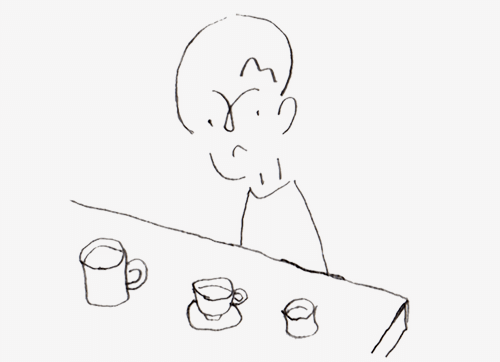

I've redesigned this web site, changing little by little for the last few weeks. The main purpose for the modification is to create a [gallery](https://www.asbi.sh/pictures/) for my sculptures and illustrations. I looked around and found lots of nice libraries and options. However, my needs for this gallery is quite simple: bundle size as small as possible, easy to apply CSS and swipe/zoom.

Finally, I've selected [Preact](https://preactjs.com/). It's an extremely tiny library, which has the same API as [React](https://reactjs.org/) and solved the above two requirements. And as for the remaining swipe/zoom, I couldn't find any suitable libraries for that, so I wrote about 300 lines.

{data-height-ratio="72.5%" data-max-width="500px" data-pos="center"}

Sometimes what's I did is called “Reinventing the wheel”. If a project has anything that needs prioritizing or implementing much more features on gesture actions, I will make different choices. But this time, I think I did it right and that it's challenging to select from among many options in these 'modern web front-end' days.

The full code for the gallery is available here.
