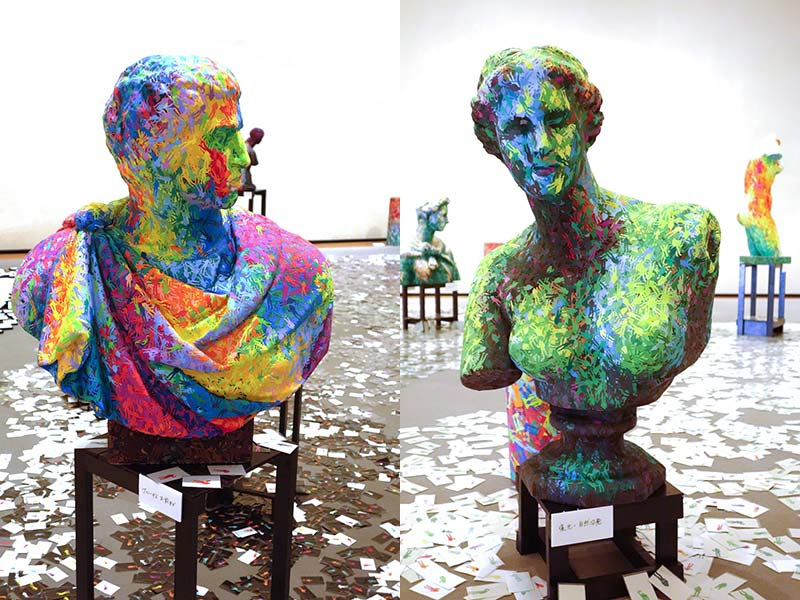
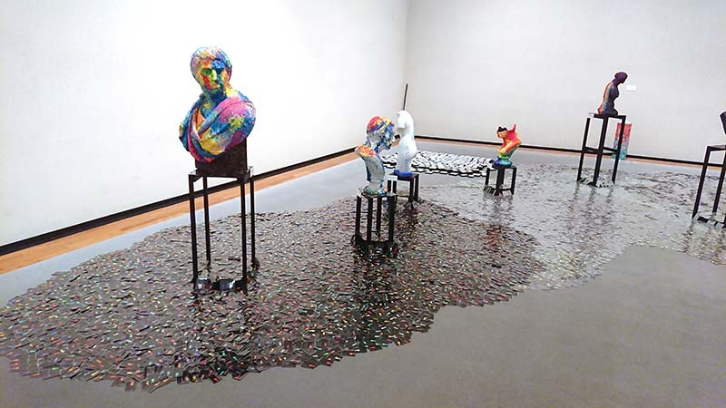
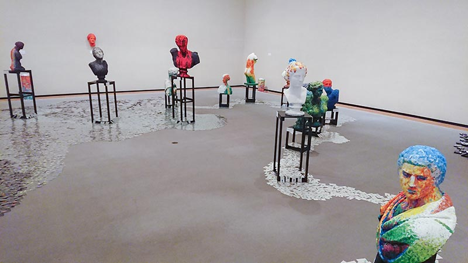
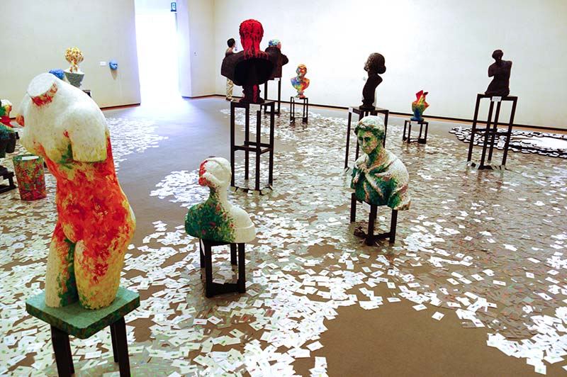
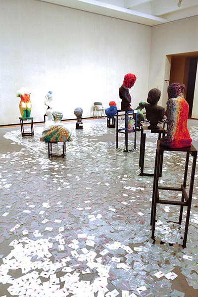
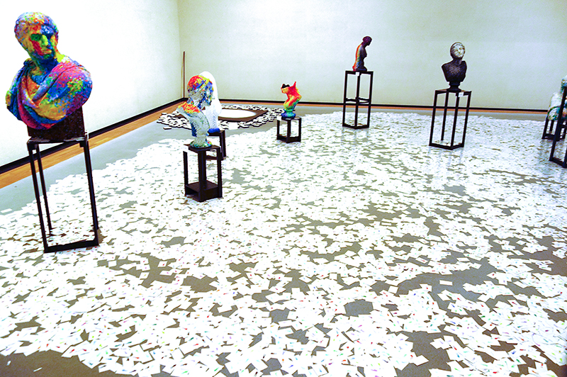
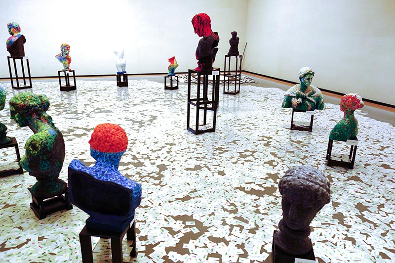
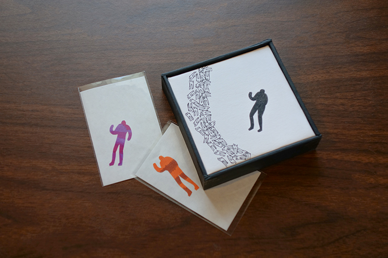

My interest in sculpting started when creating an African-like mask with cardboard at Atelier IGANDA, an art school run by Mr. Mino Kei. This year he held three exhibitions for the first time in ten years. The first one was in June, the second in July and the third exhibition [*“Mino no Venus”*](https://ti-c.net/artist/minokei/) was held in [The Museum of Art, Ehime](https://www.ehime-art.jp) from October 2 to 13. As you can guess it's a play on words from *“Venus de Milo”*.

{data-height-ratio="75%" data-max-width="800px"}

It's a hands-on exhibition. Mr. Mino requested visitors to turn over cards spread on the floor, intending to create a changing world along with them. One side of the card was black or gray, and the other side was white, and a colorful human-shape-character was in each cards. He calls the character *“Gujin(愚人)”* and it's his most significant work through his career. For this exhibition, He prepared over forty-thousand cards. He also covered all drawing casts' surfaces with many layers of these characters....

## The carry-in day
I participated in carrying artworks into the museum with Mr. Mino and his other ex-students. We laid down these cards on the floor which can be looked like a river. Most cards were placed dark-side facing up.

{data-height-ratio="56.25%" data-max-width="800px"}

{data-height-ratio="56.25%" data-max-width="800px"}

## A week later
About a hundred of primary school pupils and a few teachers visited and they turned over a lot of cards. Also there was a guy who came and turned over about a thousand of cards every day. Can you see the dust-box that is at the corner of the venue in the above picture was at a different place on the first day? Mr. Mino was changing something a little bit every day during in his exhibition.

{data-height-ratio="66.5%" data-max-width="800px"}

{data-height-ratio="150%" data-max-width="400px"}

## The last day
Finally, on the last day all cards were turned over by the morning and appeared a crystal lake. It was a delightful surprise for Mr. Mino. I think the sight of children enjoying turning over cards made everyone smile.

{data-height-ratio="66.5%" data-max-width="800px"}

{data-height-ratio="66.5%" data-max-width="800px"}

The visitors can take one card home if they turn over ten cards. And if they visit three times, they can get a *“Gujin(愚人)”* panel. The each drawing is different and the frame is handmade by Mr. Mino. His amazing amount of work has surprised me again.

{data-height-ratio="66.5%" data-max-width="800px"}
